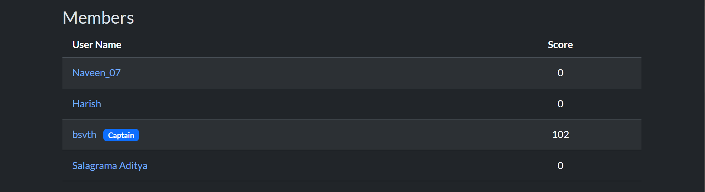
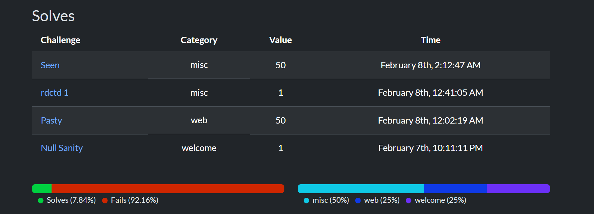

# 🏆 Nullcon CTF 2026

My first official Capture The Flag competition.

---

## 📊 Performance Summary

| Detail | Value |
|--------|-------|
| Team Name | Brain_Crackers |
| Rank | 308 |
| Score | 102 |
| Role | Main Contributor |

---

## ✅ Solved Challenges

| Challenge | Category | Points |
|-----------|----------|--------|
| Seen | Misc | 50 |
| Pasty | Web | 50 |
| rdctd 1 | Misc | 1 |
| Null Sanity | Welcome | 1 |

---

## 📁 Writeups Available

- `pasty.md` — Web challenge  
- `seen.md` — Misc challenge  
- `rdctd1.md` — Misc challenge  
- `null-sanity.md` — Welcome challenge  

---

## 📝 Key Learnings

- Introduction to competitive cybersecurity  
- Basics of insecure cryptographic systems  
- Web application analysis  
- Team collaboration  
- Time management in competitions  

---

This CTF motivated me to continue practicing and improving.

---

## 📸 Event Proof

### 🏆 Scoreboard

### 👥 Team Overview

### 🧩 Solved Challenges

